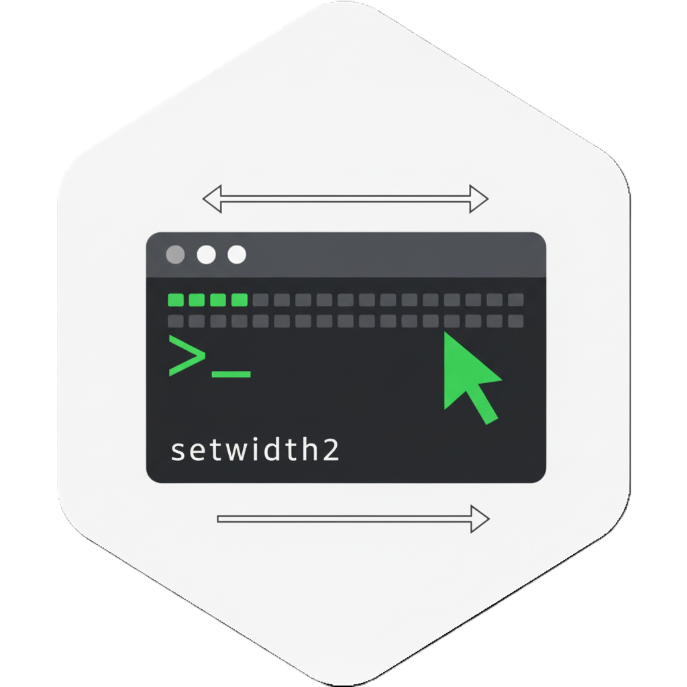

# setwidth2 R package  <a href="https://github.com/nikotinz/setwidth2"></a>


Automatically set the value of `options("width")` when the terminal emulator is resized. This package is cross-platform and works on Linux, macOS, and Windows systems when running R interactively in a terminal emulator. It is a successor to the 'setwidth' package.

## Description

`setwidth2` automatically updates the R output width to match the current terminal size. It is designed for use in interactive terminal sessions and should not be used with graphical R interfaces (such as RGui, RStudio, RKward, JGR, Rcmdr, etc.) that manage their own output display. The package installs a platform-specific event handler in C that updates `options("width")` whenever the terminal size changes. On Unix-like systems, this is done by polling the terminal size using the event loop (if available) or by using a timer fallback. On Windows, a timer is used to periodically check the console width. The handler is only activated if R is running interactively and the terminal environment is suitable.

## Installation

### From GitHub (development version)
```r
# install.packages("remotes")
remotes::install_github("nikotinz/setwidth2")
```

## Usage

The package works automatically when loaded:

```r
library(setwidth2)
```

You can control verbosity with:

```r
options(setwidth2.verbose = 1) # Print startup message
options(setwidth2.verbose = 2) # Print error message when unable to set width
options(setwidth2.verbose = 3) # Print width value
```

To disable automatic width setting:

```r
detach("package:setwidth2", unload = TRUE)
```

## Authors
- Jakson Alves de Aquino
- Dominique-Laurent Couturier
- Nikita Mozgunov

## License
GPL (>= 2)
